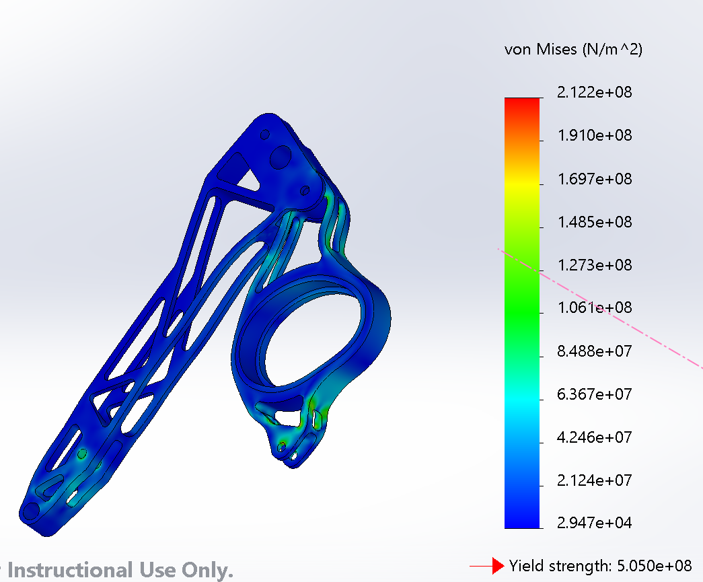

# NU Formula SAE - Differential Mounts
### Responsibilities
- Designed and manufactured differential mounts for the 2021 race car by using Solidworks CAD and NX CAM.
- Collaborated with the suspension and powertrain team to perform numerical analysis and improved accuracy of force calculations by 20%.
- Conducted topology optimization and Finite Element Analysis (FEA) in Solidworks and reduced part weight by 80%.
- website: https://northwesternformularacing.com/
### Screenshots
Final Assembly:   
   
Factor of Safety FEA:   
   
Stress Analysis FEA:   
   
